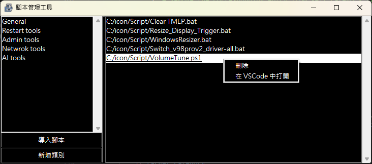

# ScriptManager



## Overview
ScriptManager is a powerful and user-friendly application designed to streamline the management and execution of scripts. Whether you are automating routine tasks or managing complex workflows, ScriptManager provides an intuitive interface and robust functionality to enhance your productivity.

## Features
- **Manage and Execute Scripts**: Easily manage and execute `.ps1` or `.bat` scripts from different locations.
- **Drag and Drop Interface**: Simple drag and drop interface.
- **Configuration Management**: Save and load different configurations for your scripts.
- **Logging**: Keep track of script executions and errors with detailed logging.

## Getting Started
### Prerequisites
Ensure you have the following prerequisites installed:
- Python >= 3.9

### Usage
1. Run the main application:
    ```bash
    python main.py
    ```
2. Use the drag and drop interface to add and manage your scripts.
3. Configure and execute scripts as needed.

## Configuration
Modify the `config.json` file to set up your desired configurations. This file allows you to customize paths, script parameters, and other settings to fit your workflow.

## Logging
Logs are stored in the `app.log` file, providing detailed information about script executions and any errors encountered. This helps in troubleshooting and maintaining your scripts efficiently.

## Contributing
We welcome contributions to improve ScriptManager. Please fork the repository and submit a pull request with your enhancements.

## License
This project is licensed under the Mozilla Public License Version 2.0. See the `LICENSE` file for details.